# 📊 Smart Telegram Expense Tracker Bot

An intelligent, multimodal financial logging assistant built with **n8n**, **Google Gemini AI**, and **Telegram**. Effortlessly track your daily personal and business expenses through plain natural text, voice notes, or photos of invoices and receipts—all parsed into structured data and synchronized directly to **Google Sheets** with an interactive confirmation workflow.

---

## 🌟 Highlights & Key Features

- 🎙️ **Multimodal Input Support:**
  - **Text:** Natural language descriptions (e.g., *"Bought 2 cans of beans for 30 EGP and milk for 40 EGP from the supermarket"*).
  - **Voice Notes:** Record voice memos on the go; Gemini transcribes and extracts data directly.
  - **Receipt & Invoice Photos:** Snap a picture of a paper receipt or invoice for instant optical extraction.
- 🧠 **Smart Multi-Item AI Extraction:**
  - Powered by **Google Gemini** to parse multiple items from a single message.
  - Automatically calculates total amounts (unit price × quantity), categorizes spending, extracts merchants/entities, payment methods, and timestamps.
- ⌨️ **Interactive Telegram Confirmation UI:**
  - Sends a clean itemized summary with Telegram **Inline Keyboards** (`✅ Confirm` / `❌ Cancel`).
  - Allows you to review what the AI extracted before finalizing records.
- 🗃️ **Two-Stage Google Sheets Sync:**
  - Stages entries immediately with `Pending` status using a unique execution ID (`row_id`).
  - On **Confirm**, updates status to `Confirmed`.
  - On **Cancel**, cleanly removes the staged row(s) to keep your ledger pristine.
- 🧩 **Modular 3-Tier Workflow Architecture:**
  - Clean separation of concerns with a **Main Router**, **AI Extraction Sub-workflow**, and **Button Callback Sub-workflow**.

---

## 🏗️ System Architecture

```mermaid
flowchart LR
    %% n8n Canvas Node Styling
    classDef trigger fill:#FF6D5A,stroke:#E05642,stroke-width:2px,color:#fff,rx:8px,ry:8px;
    classDef router fill:#34495E,stroke:#2C3E50,stroke-width:2px,color:#fff,rx:6px,ry:6px;
    classDef ai fill:#5B50E6,stroke:#4834D4,stroke-width:2px,color:#fff,rx:8px,ry:8px;
    classDef code fill:#E67E22,stroke:#D35400,stroke-width:2px,color:#fff,rx:8px,ry:8px;
    classDef sheet fill:#27AE60,stroke:#219A52,stroke-width:2px,color:#fff,rx:8px,ry:8px;
    classDef tg fill:#0088CC,stroke:#006699,stroke-width:2px,color:#fff,rx:8px,ry:8px;
    classDef subwf fill:#8E44AD,stroke:#71368A,stroke-width:2px,color:#fff,rx:8px,ry:8px;
    classDef user fill:#1E272E,stroke:#00D2D3,stroke-width:2px,color:#fff,rx:20px,ry:20px;

    User(["👤 User (Telegram)"]):::user

    %% ----------------------------------------------------
    %% 1. MAIN ROUTER
    %% ----------------------------------------------------
    subgraph WF_Main ["🚦 Main Router Workflow"]
        direction LR
        T_Trigger["⚡ Telegram Trigger<br/><i>(messages & callback_query)</i>"]:::trigger
        R_Switch{"🔀 Router Switch"}:::router
        Call_Sub1["🔗 Execute Sub-workflow 1<br/><i>(AI Extraction)</i>"]:::subwf
        Call_Sub2["🔗 Execute Sub-workflow 2<br/><i>(Button Clicks)</i>"]:::subwf

        T_Trigger --> R_Switch
        R_Switch -->|"message"| Call_Sub1
        R_Switch -->|"callback_query"| Call_Sub2
    end

    %% ----------------------------------------------------
    %% 2. SUB-WORKFLOW 1
    %% ----------------------------------------------------
    subgraph WF_Extract ["🧠 Sub-workflow 1: AI Extraction & Staging"]
        direction LR
        S1_Trigger["⚡ When Executed Trigger"]:::trigger
        S1_InputSwitch{"🔀 Input Switch"}:::router

        %% Media Downloads
        S1_GetVoice["📥 Telegram: Get Voice File"]:::tg
        S1_GetPhoto["📥 Telegram: Get Photo File"]:::tg

        %% Gemini AI Nodes
        Gemini_Text["✨ Gemini: Message Model<br/><i>(Text Analysis)</i>"]:::ai
        Gemini_Audio["✨ Gemini: Analyze Audio<br/><i>(Audio Analysis)</i>"]:::ai
        Gemini_Image["✨ Gemini: Analyze Image<br/><i>(Receipt Analysis)</i>"]:::ai

        %% Processing & Google Sheets
        S1_Parser["⚙️ Code: JSON Parser"]:::code
        S1_StatusSwitch{"🔀 Status Switch"}:::router
        S1_Clarify["💬 Telegram: Send Clarification"]:::tg
        S1_Append["📊 Google Sheets: Append Row<br/><i>(Status: Pending)</i>"]:::sheet
        S1_Summary["⚙️ Code: Summary Builder"]:::code
        S1_SendUI["💬 Telegram: Send Summary & Buttons<br/><i>(✅ Confirm / ❌ Cancel)</i>"]:::tg

        S1_Trigger --> S1_InputSwitch
        S1_InputSwitch -->|"Text"| Gemini_Text
        S1_InputSwitch -->|"Voice"| S1_GetVoice --> Gemini_Audio
        S1_InputSwitch -->|"Photo"| S1_GetPhoto --> Gemini_Image

        Gemini_Text --> S1_Parser
        Gemini_Audio --> S1_Parser
        Gemini_Image --> S1_Parser

        S1_Parser --> S1_StatusSwitch
        S1_StatusSwitch -->|"Clarification"| S1_Clarify
        S1_StatusSwitch -->|"Pending"| S1_Append --> S1_Summary --> S1_SendUI
    end

    %% ----------------------------------------------------
    %% 3. SUB-WORKFLOW 2
    %% ----------------------------------------------------
    subgraph WF_Buttons ["🔘 Sub-workflow 2: Button Interaction"]
        direction LR
        S2_Trigger["⚡ When Executed Trigger"]:::trigger
        S2_Answer["⚡ Telegram: Answer Callback"]:::tg
        S2_ActionParser["⚙️ Code: Action Parser"]:::code
        S2_ActionSwitch{"🔀 Action Switch"}:::router

        %% Confirm Branch
        S2_GetRowConfirm["📊 Google Sheets: Get Row(s)"]:::sheet
        S2_Update["📊 Google Sheets: Update Status<br/><i>(Status: Confirmed)</i>"]:::sheet
        S2_EditConfirm["💬 Telegram: Edit Message<br/><i>(✅ Confirmed)</i>"]:::tg

        %% Cancel Branch
        S2_GetRowCancel["📊 Google Sheets: Get Row(s)"]:::sheet
        S2_Delete["📊 Google Sheets: Delete Row(s)"]:::sheet
        S2_EditCancel["💬 Telegram: Edit Message<br/><i>(❌ Cancelled)</i>"]:::tg

        S2_Trigger --> S2_Answer --> S2_ActionParser --> S2_ActionSwitch
        S2_ActionSwitch -->|"confirm"| S2_GetRowConfirm --> S2_Update --> S2_EditConfirm
        S2_ActionSwitch -->|"cancel"| S2_GetRowCancel --> S2_Delete --> S2_EditCancel
    end

    %% Connections from User & Router
    User ==>|"1. Text / Voice / Receipt"| T_Trigger
    User ==>|"2. Clicks Confirm / Cancel"| T_Trigger
    Call_Sub1 -.->|"Executes"| S1_Trigger
    Call_Sub2 -.->|"Executes"| S2_Trigger
```



---

## 📁 Repository Structure

```
smart-telegram-expense-tracker/
├── Main Router Workflow.json          # Entrypoint router for incoming messages & callbacks
├── Sub-workflow 1 - AI Extraction.json # Handles multimodal Gemini extraction & sheet staging
├── Sub-workflow 2 - Button Clicks.json # Handles inline button callbacks (confirm/delete)
└── README.md                          # Project documentation
```

---

## 🗃️ Google Sheets Database Schema

Create a Google Sheet document (e.g., named `Expense Tracker DB`) with **Sheet1** containing the following exact column headers in **Row 1**:

| Column Name | Type | Description | Example |
| :--- | :--- | :--- | :--- |
| `row_id` | String | Unique execution ID linking multi-item batches | `261` |
| `date` | String | Transaction date (`YYYY-MM-DD`) | `2026-08-19` |
| `inserted_by` | String | Sender's full name from Telegram | `Ahmed Ali` |
| `direction` | String | Cashflow direction (`Expense` / `Income`) | `Expense` |
| `transaction_type` | String | Nature of transaction (`Payment` / `Transfer`) | `Payment` |
| `amount` | Number | Total cost for the line item | `90` |
| `quantity` | Number | Quantity purchased | `2` |
| `currency` | String | Currency code | `EGP`, `USD`, `SAR` |
| `entity` | String | Merchant, vendor, or store name | `Carrefour Market` |
| `category` | String | Expense category | `Groceries`, `Food & Dining` |
| `item_name` | String | Clean product/service name | `Mozzarella Cheese` |
| `payment_method` | String | Method of payment | `Cash`, `Credit Card` |
| `notes` | String | Full user phrasing or unit price notes | `2 packs @ 45 EGP each` |
| `status` | String | Status (`Pending` or `Confirmed`) | `Confirmed` |

---

## 🚀 Setup & Installation

### 1. Prerequisites
Ensure you have the following accounts and credentials ready:
- An active **[n8n](https://n8n.io/)** instance (Self-hosted, Docker, or n8n Cloud).
- A **Telegram Bot Token** from [@BotFather](https://t.me/botfather).
- A **Google Gemini API Key** from [Google AI Studio](https://aistudio.google.com/).
- A **Google Cloud Project** with Google Sheets API enabled (or Google Sheets OAuth2 configured in n8n).

---

### 2. Configure Google Sheets & Credentials in n8n

1. **Google Sheets OAuth2:**
   - In n8n, go to **Credentials** > **Add Credential** > **Google Sheets OAuth2 API**.
   - Authenticate with your Google account and grant spreadsheet permissions.
2. **Telegram API:**
   - Go to **Credentials** > **Add Credential** > **Telegram API**.
   - Paste your bot token obtained from [@BotFather](https://t.me/botfather).
3. **Google Gemini (PaLM) API:**
   - Go to **Credentials** > **Add Credential** > **Google Gemini(PaLM) Api**.
   - Paste your API Key from Google AI Studio.

---

### 3. Import & Configure Workflows

Import the three workflow JSON files into your n8n workspace in the following order:

#### Step A: Import `Sub-workflow 1 - AI Extraction.json`
1. Create a new workflow, click **...** (top right) > **Import from File**, and select `Sub-workflow 1 - AI Extraction.json`.
2. Connect your credentials:
   - **Gemini nodes** (`Message a model`, `Analyze audio`, `Analyze an image`) ➔ Link your Gemini API credential.
   - **Telegram nodes** (`Get a file`, `Get a file1`, `Send a text message`, `Send a text message1`) ➔ Link your Telegram account credential.
   - **Google Sheets node** (`Append row in sheet`) ➔ Link your Google Sheets credential, select your spreadsheet (`Expense Tracker DB`), and choose `Sheet1`.
3. Save the workflow and copy its **Workflow ID** from the URL bar (or workflow settings).

#### Step B: Import `Sub-workflow 2 - Button Clicks.json`
1. Create a new workflow and import `Sub-workflow 2 - Button Clicks.json`.
2. Connect your credentials:
   - **Telegram nodes** (`Answer Query a callback`, `Edit a text message`, `Edit a text message1`) ➔ Link your Telegram credential.
   - **Google Sheets nodes** (`Get row(s) in sheet`, `Update row in sheet`, `Get row(s) in sheet2`, `Delete rows or columns from sheet`) ➔ Link your Google Sheets credential and select your spreadsheet.
3. Save the workflow and copy its **Workflow ID**.

#### Step C: Import & Link `Main Router Workflow.json`
1. Create a new workflow and import `Main Router Workflow.json`.
2. Link your **Telegram API** credential in the `Telegram Trigger` node.
3. In the **Execute Workflow** nodes:
   - Point the **Messages** branch node to your saved **Sub-workflow 1 (AI Extraction)**.
   - Point the **Button Clicks** branch node to your saved **Sub-workflow 2 (Button Clicks)**.
4. Save and toggle **Active** to `ON` for all three workflows.

---

## 💡 Usage Guide & Examples

### 1. Sending Expenses via Telegram

Open a chat with your Telegram Bot and submit your expenses using your preferred format:

#### 💬 Text Message
> *"I bought 2 cans of tuna for 60 EGP and 1 brown bread for 15 EGP from Metro Market with cash"*

#### 🎤 Voice Note
> Press and hold the microphone button and say:  
> *"Spent 250 pounds on fuel at Total Gas Station using credit card."*

#### 📸 Receipt / Invoice Image
> Take a clear photo of your store receipt or supermarket bill and send it directly to the chat.

---

### 2. Review & Confirmation Flow

```text
Bot:
📝 ملخص المشتريات:

1. تونة (2 علبة تونة بـ 60) - العدد: 2 - 60 EGP
2. عيش بلدي (1 عيش بلدي بـ 15) - 15 EGP

💰 الإجمالي: 75 EGP

[ ✅ Confirm ]  [ ❌ Cancel ]
```

1. **Click `✅ Confirm`:**
   - The bot edits the message to `✅ تم تأكيد العملية وحفظها بنجاح!` (*Operation confirmed and saved successfully!*).
   - In Google Sheets, the staged rows' status is updated from `Pending` to `Confirmed`.
2. **Click `❌ Cancel`:**
   - The bot edits the message to `تم إلغاء العملية بنجاح ❌` (*Operation cancelled successfully!*).
   - The pending row(s) are cleanly deleted from Google Sheets.

---

## 🛡️ Built-in Resilience & Edge Cases

- **Batch Multi-Item Tracking:** When a single receipt or message contains multiple items, all items are tagged with the same execution `row_id`, allowing bulk confirmation or cancellation in one click.
- **Dynamic Clarification Routing:** If an input cannot be parsed or lacks vital financial info, Gemini routes the status as `clarification_needed`, prompting the user for details instead of inserting corrupted data.
- **Robust JSON Cleanup:** Code nodes sanitize Markdown code blocks (````json ... ````) and guarantee output is always formatted as a clean iterable array for n8n.

---

## 📄 License

This project is licensed under the [MIT License](LICENSE). Feel free to modify and adapt it for your personal or organization needs.
