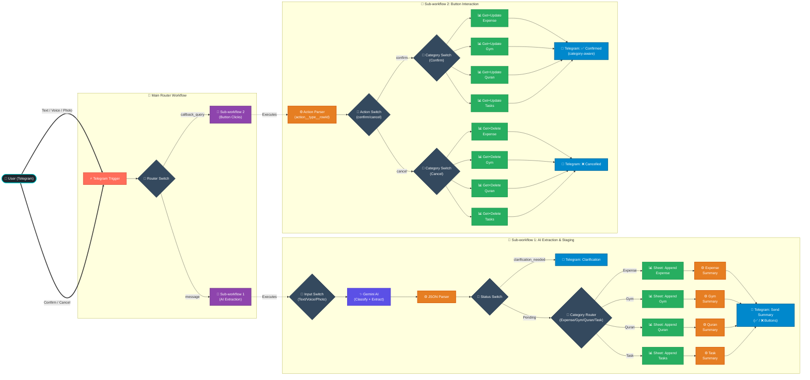

# 🧠 Life OS — Smart Telegram Tracker Bot

An intelligent, multimodal **Life Operating System** built with **n8n**, **Google Gemini AI**, and **Telegram**. Log your daily expenses, gym workouts, Quran reading, and tasks through plain natural text, voice notes, or photos — all parsed into structured data and synchronized to **Google Sheets** with an interactive confirmation workflow.

---

## 🌟 Highlights & Key Features

- 🎙️ **Multimodal Input — 3 Input Types:**
  - **Text:** Natural language in Arabic or English
  - **Voice Notes:** Gemini transcribes and extracts structured data directly
  - **Photos:** Send a receipt, whiteboard, or handwritten note for instant extraction

- 🧠 **4-Category Smart AI Extraction (Single Gemini Call):**
  - Automatically classifies each message into the correct category
  - Extracts all relevant fields per category in one pass
  - Arabic + English understood natively

  | Category | Tracks | Arabic Triggers |
  |---|---|---|
  | 💰 **Expense** | Purchases, bills, payments | اشتريت، دفعت، صرفت |
  | 🏋️ **Gym** | Exercises, sets, reps, weight | جيم، تمرين، سيت، رياضة |
  | 📖 **Quran** | Surahs read, ayah range, pages | قرأت، ورد، سورة، ختمة |
  | ✅ **Task** | To-dos, reminders, priorities | مهمة، لازم، تذكير |

- ⌨️ **Interactive Telegram Confirmation UI:**
  - Sends a categorized summary with `✅ تأكيد` / `❌ إلغاء` inline keyboard
  - Confirm → updates status to `Confirmed` in the correct sheet tab
  - Cancel → deletes the pending row(s) cleanly

- 🗃️ **One Spreadsheet, Four Sheet Tabs:**
  - All categories live in one Google Sheets document
  - Each category has its own dedicated tab with its own schema

- 🧩 **Modular 3-Tier Workflow Architecture:**
  - **Main Router** → **AI Extraction Sub-workflow** → **Button Callback Sub-workflow**

---

## 🆕 What's New in v2 (Life OS Expansion)

If you are upgrading from v1 (Expense-only), here are the new nodes and sheets we added to the workflows:

**New n8n Nodes Added:**
- **Category Router (`Switch` node):** Added to Sub-workflow 1 to route the Gemini output based on the `record_type` (Expense, Gym, Quran, Task).
- **Category Switches (`Switch` nodes):** Added to Sub-workflow 2 to route both `confirm` and `cancel` button clicks to the correct sheet.
- **Dedicated Append Nodes:** 3 new Google Sheets `Append` nodes in Sub-workflow 1 for Gym, Quran, and Tasks.
- **Dedicated Get/Update/Delete Nodes:** 12 new Google Sheets nodes in Sub-workflow 2 (4 Get, 4 Update, 4 Delete) to handle confirmation and cancellation per category.
- **Summary Builders (`Code` nodes):** 4 separate JavaScript code nodes in Sub-workflow 1 to format Telegram messages with category-specific emojis.

**New Google Sheets Tabs Created:**
- 🏋️ `Gym` (gid=1067827227)
- 📖 `Quran` (gid=997258062)
- ✅ `Tasks` (gid=840579677)

---

## 🏗️ System Architecture



---

## 📁 Repository Structure

```
smart-telegram-expense-tracker/
├── WorkFlows/
│   ├── Main Router Workflow.json           # Entrypoint — routes messages vs. callbacks
│   ├── Sub-workflow 1 - AI Extraction.json # AI classify+extract, category routing, staging
│   └── Sub-workflow 2 - Button Clicks.json # Confirm/cancel button handler per category
└── README.md
```

---

## 🗃️ Google Sheets Database Schema

One spreadsheet document, four tabs. 

> [!IMPORTANT]
> **Use your own Spreadsheet ID:** The workflows expect a specific Google Sheet. You must copy the ID of your own spreadsheet from its URL (`https://docs.google.com/spreadsheets/d/YOUR_SPREADSHEET_ID/edit`) and select it inside every Google Sheets node in the workflows.

---

### Tab 1: `Sheet1` — Expenses (`gid=0`)

| Column | Type | Description | Example |
|---|---|---|---|
| `row_id` | String | Execution ID linking batch items | `exec-abc-123` |
| `date` | String | Date `YYYY-MM-DD` | `2026-08-26` |
| `inserted_by` | String | Telegram sender name | `Ahmed Ali` |
| `direction` | String | `Expense` / `Income` | `Expense` |
| `transaction_type` | String | `Payment` / `Transfer` | `Payment` |
| `amount` | Number | Total cost | `90` |
| `quantity` | Number | Quantity purchased | `2` |
| `currency` | String | Currency code | `EGP` |
| `entity` | String | Store / vendor name | `Carrefour` |
| `category` | String | Spending category | `Groceries` |
| `item_name` | String | Product name | `Mozzarella` |
| `payment_method` | String | `Cash` / `Credit Card` | `Cash` |
| `notes` | String | Full user description | `2 packs @ 45 EGP` |
| `status` | String | `Pending` / `Confirmed` | `Confirmed` |

---

### Tab 2: `Gym` — Workouts (`gid=1067827227`)

| Column | Type | Description | Example |
|---|---|---|---|
| `row_id` | String | Execution ID | `exec-abc-123` |
| `date` | String | Workout date | `2026-08-26` |
| `inserted_by` | String | Telegram sender name | `Ahmed Ali` |
| `exercise_name` | String | Exercise in English | `Bench Press` |
| `muscle_group` | String | Target muscle | `Chest` |
| `sets` | Number | Number of sets | `4` |
| `reps` | Number | Reps per set | `10` |
| `weight` | Number | Weight used | `80` |
| `weight_unit` | String | `kg` or `lbs` | `kg` |
| `notes` | String | Full description | `felt heavy today` |
| `status` | String | `Pending` / `Confirmed` | `Confirmed` |

---

### Tab 3: `Quran` — Daily Reading (`gid=997258062`)

| Column | Type | Description | Example |
|---|---|---|---|
| `row_id` | String | Execution ID | `exec-abc-123` |
| `date` | String | Reading date | `2026-08-26` |
| `inserted_by` | String | Telegram sender name | `Ahmed Ali` |
| `surah_name` | String | Arabic surah name | `الكهف` |
| `surah_number` | Number | Surah number (1-114) | `18` |
| `start_ayah` | Number | Starting ayah | `1` |
| `end_ayah` | Number | Ending ayah | `110` |
| `pages_read` | Number | Pages read | `10` |
| `notes` | String | Notes | `` |
| `status` | String | `Pending` / `Confirmed` | `Confirmed` |

---

### Tab 4: `Tasks` — To-Do List (`gid=840579677`)

| Column | Type | Description | Example |
|---|---|---|---|
| `row_id` | String | Execution ID | `exec-abc-123` |
| `date` | String | Log date | `2026-08-26` |
| `inserted_by` | String | Telegram sender name | `Ahmed Ali` |
| `task_description` | String | Clear task description | `مراجعة تقرير الشغل` |
| `priority` | String | `High` / `Medium` / `Low` | `High` |
| `due_date` | String | `YYYY-MM-DD` or `Unspecified` | `2026-08-28` |
| `status` | String | `Pending` / `Confirmed` | `Confirmed` |

---

## 🚀 Setup & Installation

### 1. Prerequisites
- An active **[n8n](https://n8n.io/)** instance
- A **Telegram Bot Token** from [@BotFather](https://t.me/botfather)
- A **Google Gemini API Key** from [Google AI Studio](https://aistudio.google.com/)
- A **Google Sheets** document with 4 tabs configured (see schemas above)

---

### 2. Create Your Google Sheets Tabs

In your spreadsheet, create 4 tabs with these exact names and headers in **Row 1**:

| Tab Name | Headers (in order) |
|---|---|
| `Sheet1` | `row_id`, `date`, `inserted_by`, `direction`, `transaction_type`, `amount`, `quantity`, `currency`, `entity`, `category`, `item_name`, `payment_method`, `notes`, `status` |
| `Gym` | `row_id`, `date`, `inserted_by`, `exercise_name`, `muscle_group`, `sets`, `reps`, `weight`, `weight_unit`, `notes`, `status` |
| `Quran` | `row_id`, `date`, `inserted_by`, `surah_name`, `surah_number`, `start_ayah`, `end_ayah`, `pages_read`, `notes`, `status` |
| `Tasks` | `row_id`, `date`, `inserted_by`, `task_description`, `priority`, `due_date`, `status` |

---

### 3. Configure Credentials in n8n

| Credential Type | Used In |
|---|---|
| **Google Sheets OAuth2** | All Append / Get / Update / Delete nodes |
| **Telegram API** | Trigger, Get file, Send message, Edit message nodes |
| **Google Gemini (PaLM) API** | Message a model, Analyze audio, Analyze an image |

---

### 4. Import & Link Workflows

Import in this order:

**A. Sub-workflow 1 — AI Extraction**
1. Import `Sub-workflow 1 - AI Extraction.json`
2. Link credentials for: Gemini nodes, Telegram nodes, all 4 Google Sheets Append nodes
3. Save — note the **Workflow ID**

**B. Sub-workflow 2 — Button Clicks**
1. Import `Sub-workflow 2 - Button Clicks.json`
2. Link credentials for: Telegram nodes, all 8 Google Sheets Get/Update/Delete nodes
3. Save — note the **Workflow ID**

**C. Main Router**
1. Import `Main Router Workflow.json`
2. Link **Telegram API** credential in the Trigger node
3. Point the two Execute Workflow nodes to Sub-workflow 1 and Sub-workflow 2 IDs
4. Toggle **Active → ON** on all three workflows

---

## 💡 Usage Examples

### 💰 Log Expenses
```
اشتريت حليب بـ 20 جنيه وعيش بـ 10 من المخبز
```
```
I paid 250 EGP for fuel at Total Gas Station with credit card
```

### 🏋️ Log Gym Session
```
اليوم في الجيم: bench press 4 سيت × 10 تكرار 80 كيلو، squats 3 سيت × 8 تكرار 100 كيلو
```
```
Did 4 sets of pull-ups and 3 sets of dips bodyweight
```

### 📖 Log Quran Reading
```
قرأت سورة الكهف من الآية 1 للآية 110، حوالي 10 صفحات
```
```
ورد اليوم: سورة البقرة من 1 لـ 50
```

### ✅ Log a Task
```
مهمة: مراجعة تقرير الشغل، أولوية عالية، يوم الخميس
```
```
reminder: call the doctor tomorrow, high priority
```

---

### Confirmation Flow

After any input, the bot replies with a categorized summary:

```
🏋️ ملخص التمرين:

1. Bench Press (Chest) — 4 سيت × 10 تكرار — 80 kg
2. Squats (Legs) — 3 سيت × 8 تكرار — 100 kg

[ ✅ تأكيد ]  [ ❌ إلغاء ]
```

| Action | Sheet Effect | Telegram Reply |
|---|---|---|
| **✅ تأكيد** | `status` → `Confirmed` in correct tab | `✅ تم حفظ تمرين اليوم بنجاح! 💪` |
| **❌ إلغاء** | Row(s) deleted | `تم إلغاء العملية بنجاح ❌` |

The confirmation message is **category-aware** — each category shows a different emoji and message.

---

## 🛡️ Built-in Resilience

- **Batch Tracking:** Multiple items (e.g., 5 exercises) share the same `row_id` — one confirm button handles all of them
- **Clarification Routing:** If Gemini can't parse the input, it sends a clarification question instead of inserting bad data
- **Category Isolation:** Each category routes to its own sheet tab — no cross-contamination
- **Callback Integrity:** Callback data format `confirm__Expense__rowId` (double-underscore) prevents parsing ambiguity
- **JSON Cleanup:** Code nodes strip markdown code blocks and guarantee a clean array output

---

## 📄 License

This project is licensed under the [MIT License](LICENSE). Feel free to modify and adapt it for your personal or organization needs.
