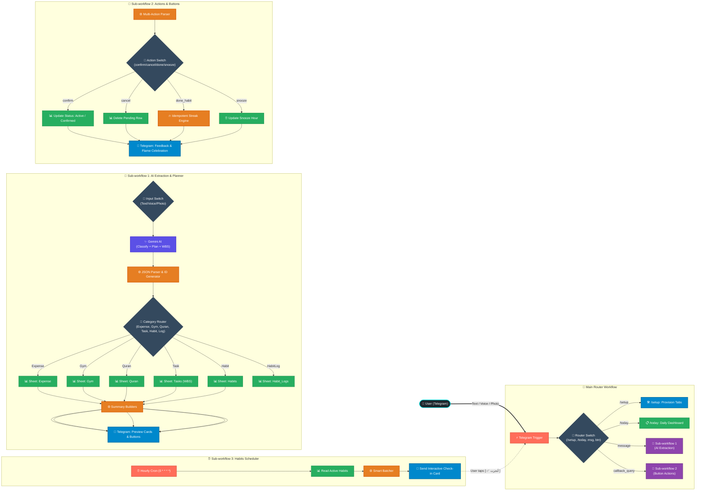

# 🧠 Life OS v3 — Smart Telegram Tracker & Task Planner Bot

An intelligent, multimodal **Life Operating System** built with **n8n**, **Google Gemini AI**, and **Telegram**. Log your daily expenses, gym workouts, Quran reading, tasks, and recurring daily habits through plain natural language, voice notes, or photos — all synchronized to **Google Sheets** with interactive Telegram confirmation cards and automated streak tracking.

---

## 🌟 Highlights & Key Features

- 🎙️ **Multimodal Input — 3 Input Types:**
  - **Text:** Natural language in Arabic or English
  - **Voice Notes:** Gemini transcribes, extracts structured data, and provides habit feedback
  - **Photos:** Send receipts, whiteboards, or handwritten notes for instant extraction

- 🧠 **6-Category Smart AI Engine (Single Gemini Call):**
  - Automatically classifies each message into the exact category
  - Arabic + English understood natively

  | Category | Tracks | Arabic Triggers |
  |---|---|---|
  | 💰 **Expense** | Purchases, bills, payments | اشتريت، دفعت، صرفت، فاتورة |
  | 🏋️ **Gym** | Exercises, sets, reps, weight | جيم، تمرين، سيت، رياضة، وزن |
  | 📖 **Quran** | Surahs read, ayah range, pages | قرأت، ورد، سورة، ختمة |
  | ✅ **Task** | One-off to-dos & complex projects with WBS | مهمة، لازم، تذكير، مشروع، خطط لي |
  | 🎯 **Habit** | Recurring daily routines with streaks & pings | عادة، اتعلم، اتدرب، كل يوم، روتين |
  | ⚡ **HabitLog** | Natural language / voice check-off | خلصت إنجليزي، أنجزت الورد |

- 📋 **Intelligent Task Planning & WBS Decomposition:**
  - **Atomic Errands (< 30 min):** Logged cleanly as single to-dos (no over-engineering).
  - **Complex Projects:** Automatically decomposed into an actionable checklist with durations and milestones.

- ⏰ **Automated Daily Habit Reminders & Smart Batching:**
  - **Hourly Scanner:** Pings you at your preferred reminder time (e.g. 8:00 PM for English).
  - **Smart Batching:** Multiple habits due at the same hour are combined into a single, clean Telegram card.
  - **One-Tap Check-in:** Tap `[ ✅ أنجزت الـ 15 دقيقة ]` to log completion and increment your streak!
  - **Stateless Snooze:** Tap `[ ⏳ تأجيل ساعة ]` to delay the reminder safely.

- 🛠️ **Zero-Friction Auto-Provisioning (`/setup`):**
  - Send `/setup` in Telegram, and n8n inspects your Google Sheet, creates any missing tabs, and seeds all column headers automatically!

- 📅 **Interactive Daily Dashboard (`/today`):**
  - Send `/today` or *"مهام اليوم"* to see your active daily habits, streaks, and pending tasks.

---

## 🆕 What's New in v3 (Task Planner & Habit Engine)

1. **Sub-workflow 3 — Daily Habits Scheduler:** Dedicated hourly cron scanner that reads active habits from Google Sheets and dispatches batched check-in cards.
2. **Habits & Streak Tracking:** Idempotent streak calculation preventing accidental double-counting, with best-streak records.
3. **WBS Task Decomposition:** Complex tasks like *"تجهيز بريزنتيشن لاجتماع الإدارة"* are structured into parent projects + actionable subtasks.
4. **Natural Language Voice Check-offs:** Speak *"خلصت الـ 15 دقيقة إنجليزي"* via voice note to log your habit without touching a button.
5. **Auto-Provisioning (`/setup`):** Instant database setup without manual spreadsheet editing.

---

## 🏗️ System Architecture



---

## 📁 Repository Structure

```
smart-telegram-expense-tracker/
├── WorkFlows/
│   ├── Main Router Workflow.json                  # Entrypoint — commands, messages vs. callbacks
│   ├── Sub-workflow 1 - AI Extraction.json        # AI classification, task WBS, habit staging
│   ├── Sub-workflow 2 - Button Clicks.json        # Confirm/cancel, streak engine, snooze handler
│   └── Sub-workflow 3 - Daily Habits Scheduler.json # Hourly scanner sending batched check-in cards
└── README.md
```

---

## 🗃️ Google Sheets Database Schemas

All categories live in **one spreadsheet document across 6 dedicated tabs**:

> [!TIP]
> **Automatic Setup:** You don't have to create these headers by hand. Simply send `/setup` to your Telegram bot once, and all tabs are verified and prepared automatically!

---

### Tab 1: `Sheet1` — Expenses (`gid=0`)
`row_id`, `date`, `inserted_by`, `direction`, `transaction_type`, `amount`, `quantity`, `currency`, `entity`, `category`, `item_name`, `payment_method`, `notes`, `status`

### Tab 2: `Gym` — Workouts (`gid=1067827227`)
`row_id`, `date`, `inserted_by`, `exercise_name`, `muscle_group`, `sets`, `reps`, `weight`, `weight_unit`, `notes`, `status`

### Tab 3: `Quran` — Daily Reading (`gid=997258062`)
`row_id`, `date`, `inserted_by`, `surah_name`, `surah_number`, `start_ayah`, `end_ayah`, `pages_read`, `notes`, `status`

### Tab 4: `Tasks` — Projects & To-Dos (`gid=840579677`)
| Column | Type | Description | Example |
|---|---|---|---|
| `row_id` | String | Execution ID linking the batch | `exec-abc-123` |
| `task_id` | String | Unique item identifier | `T-abc12` (or `T-abc12-1` for subtask) |
| `parent_task_id` | String | Empty if main task, or links to parent ID | `T-abc12` |
| `telegram_chat_id` | Number | Numeric chat ID for reminders | `123456789` |
| `date` | String | Creation date `YYYY-MM-DD` | `2026-09-03` |
| `inserted_by` | String | Telegram sender display name | `Ahmed Ali` |
| `task_description` | String | Title or subtask step | `جمع بيانات وتحليل أرقام الربع الأول` |
| `priority` | String | `High` / `Medium` / `Low` | `High` |
| `estimated_minutes` | Number | Estimated duration | `45` |
| `due_date` | String | Deadline `YYYY-MM-DD` | `2026-09-06` |
| `status` | String | `Pending` / `To Do` / `Completed` | `To Do` |

### Tab 5: `Habits` — Daily Routines & Streaks
| Column | Type | Description | Example |
|---|---|---|---|
| `habit_id` | String | Unique habit ID | `H-4812` |
| `telegram_chat_id` | Number | Numeric chat ID for background cron pings | `123456789` |
| `date_created` | String | Creation date | `2026-09-03` |
| `inserted_by` | String | Telegram sender display name | `Ahmed Ali` |
| `habit_name` | String | Name of habit | `Learn English` |
| `category` | String | `Learning` / `Health` / `Deen` / `Work` | `Learning` |
| `frequency` | String | `Daily` / `Weekdays` | `Daily` |
| `target_minutes` | Number | Target duration per day | `15` |
| `reminder_time` | String | Scheduled time in 24h format | `20:00` |
| `snooze_until` | String | Temporary snooze hour | `` |
| `current_streak` | Number | Current active streak | `11` |
| `best_streak` | Number | Best streak record | `15` |
| `last_completed_date` | String | `YYYY-MM-DD` of last completion | `2026-09-02` |
| `status` | String | `Pending` / `Active` / `Paused` | `Active` |

### Tab 6: `Habit_Logs` — Daily Completion Log
`log_id`, `habit_id`, `date`, `time_spent`, `notes`, `inserted_by`

---

## 🚀 Setup & Installation

### 1. Prerequisites
- An active **n8n** instance
- A **Telegram Bot Token** from [@BotFather](https://t.me/botfather)
- A **Google Gemini API Key** from [Google AI Studio](https://aistudio.google.com/)
- A **Google Sheets** document

---

### 2. Configure Credentials in n8n

| Credential Type | Used In |
|---|---|
| **Google Sheets OAuth2** | All Google Sheets nodes across workflows |
| **Telegram API** | Trigger, Send message, Edit message nodes |
| **Google Gemini (PaLM) API** | Message a model, Analyze audio, Analyze an image |

---

### 3. Import & Activate Workflows

1. **Import `Sub-workflow 1 - AI Extraction.json`** & link credentials.
2. **Import `Sub-workflow 2 - Button Clicks.json`** & link credentials.
3. **Import `Sub-workflow 3 - Daily Habits Scheduler.json`** & link credentials.
4. **Import `Main Router Workflow.json`**, point execute nodes to sub-workflows 1 & 2, and activate.
5. **One-Click Provisioning:** Open your Telegram bot and send `/setup`.

---

## 💡 Usage Examples

### 🎯 1. Set Up a Daily Recurring Habit
```text
عايز أتعلم إنجليزي ربع ساعة كل يوم، فكرني الساعة 8 بالليل
```
```text
I want to practice coding for 30 minutes every day at 19:00
```
- **Bot Reply:**
  ```text
  🎯 تم إعداد عادة جديدة:
  ✨ Learn English
  ⏱️ المدة اليومية: 15 دقيقة
  ⏰ وقت التذكير: 20:00
  🔁 التكرار: يومياً
  
  [ ✅ تأكيد ]   [ ❌ إلغاء ]
  ```

---

### ⏰ 2. Automated Daily Check-in & Streak Celebration
At 8:00 PM, the bot automatically sends:
```text
🎯 حان وقت عاداتك لليوم (الساعة 20:00):

1. ✨ Learn English (15 دقيقة) — Streak: 11 🔥

[ ✅ أنجزت: Learn English ]
[ ⏳ تأجيل التذكير ساعة ]
```
When you tap **`[ ✅ أنجزت: Learn English ]`**:
```text
✅ عاش جداً! تم تسجيل 15 دقيقة لـ (Learn English) لليوم.
🔥 الـ Streak الحالي: 12 يوم متواصل!
⏱️ إجمالي ما أنجزته: 180 دقيقة
```

---

### ⚡ 3. Natural Language & Voice Check-off
You can also complete habits by typing or sending a voice note:
```text
خلصت الـ 15 دقيقة إنجليزي اليوم
```
- **Bot Reply:**
  `✅ عاش جداً يا بطل! تم تسجيل إنجاز عادة (Learn English) لليوم بنجاح! 💪`

---

### 📋 4. Plan a Complex Task with WBS
```text
عايز أجهز بريزنتيشن لاجتماع الإدارة الأسبوع الجاي
```
- **Bot Reply:**
  ```text
  ✅ ملخص المهام:

  🎯 تجهيز بريزنتيشن لاجتماع الإدارة
  ⚡ الأولوية: High
  ⏱️ الوقت المقدر: 135 دقيقة

  📌 الخطوات المقترحة (WBS):
  1. [ ] جمع بيانات وتحليل أرقام الربع الأول (45 د)
  2. [ ] تصميم الشرائح وتلخيص النقاط الرئيسية (60 د)
  3. [ ] مراجعة العرض والبروفة النهائية (30 د)

  [ ✅ تأكيد ]   [ ❌ إلغاء ]
  ```

---

### 📅 5. Daily Dashboard (`/today`)
Send `/today` to get a consolidated overview of your progress:
```text
📅 لوحة إنجاز اليوم (2026-09-03):

🔥 عاداتك اليومية:
1. Learn English — ✅ منجز (Streak: 12 🔥)
2. تمارين الإطالة — ⏳ متبقي

💡 لإنجاز عادة أرسل: "خلصت تمارين الإطالة اليوم"
```

---

## 🛡️ Built-in Resilience & Edge-Case Protection

- **Ghost Chat ID Protection:** Numeric `telegram_chat_id` is automatically recorded during habit setup so background crons always know who to ping.
- **Idempotent Streak Logic:** Tapping `[ ✅ أنجزت ]` twice on the same day acknowledges completion without incrementing the streak again.
- **Stateless Snooze:** Snoozing writes `snooze_until` directly to Sheets, surviving server/container reboots.
- **Atomic Errand Protection:** Simple errands (`"اشتري عيش"`) are logged as single tasks; only complex projects trigger WBS subtasks.
- **Smart Notification Batching:** Multiple habits due at the same hour are sent together in a single card, avoiding notification spam and Telegram rate limits.

---

## 📄 License

This project is licensed under the [MIT License](LICENSE). Feel free to modify and adapt it for your personal or organization needs.
